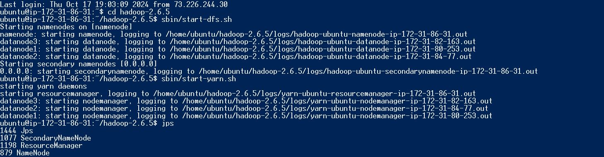
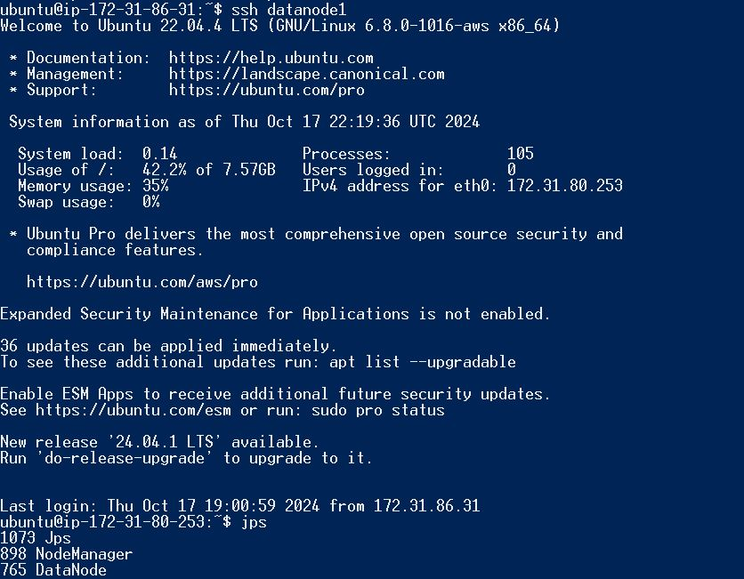
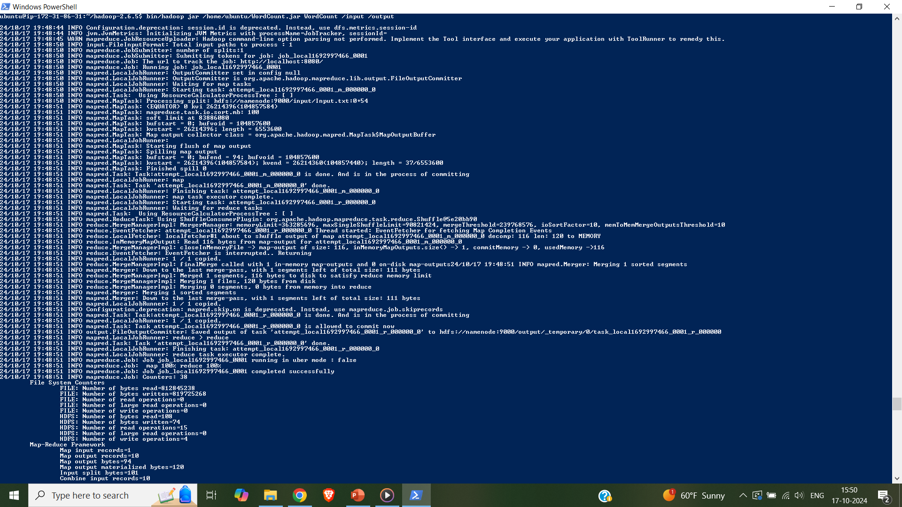
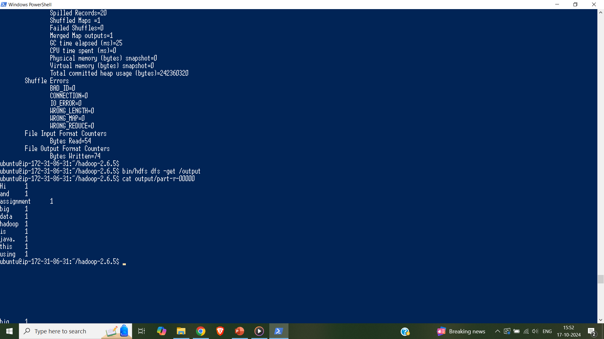

# AWS-MapReduce-Distributed-WordCount

A distributed WordCount program using Hadoop MapReduce on a 4-node AWS EC2 cluster (1 NameNode, 3 DataNodes) with HDFS and Java.

## Technologies Used

- Java
- Apache Hadoop 2.6.5
- HDFS (Hadoop Distributed File System)
- MapReduce
- AWS EC2 (Ubuntu 20.04 instances)
- SSH for cluster setup

---

## Cluster Configuration

| Node Role  | Description                             |
| ---------- | --------------------------------------- |
| NameNode   | Master node (JobTracker, HDFS NameNode) |
| DataNode 1 | Slave node                              |
| DataNode 2 | Slave node                              |
| DataNode 3 | Slave node                              |

All nodes are **interconnected via SSH**, and Hadoop is configured for **distributed mode** with proper core-site.xml, hdfs-site.xml, mapred-site.xml, and yarn-site.xml settings.





---

## Files

- `WordCount.java` – Main driver program
- `WordCountMapper.java` – Mapper logic to emit each word
- `WordCountReducer.java` – Reducer to sum word occurrences
- `input.txt` – Sample input file
- `output.txt` – Sample output file
- `instruction.txt` – Manual steps to compile and run the job
- Screenshots:
  - `Master_jps.JPG` – Hadoop daemons running
  - `Program run.png` – Job execution screenshot
  - `Output.png` – Final HDFS output

---

## How to Run

> Ensure Hadoop is configured and the cluster is running.

### 1. Compile the Java Code

```bash
javac -cp $CLASSPATH -d . WordCount.java WordCountMapper.java WordCountReducer.java
```

### 2. Create the JAR File

```bash
jar cvf WordCount.jar -C . .
```

### 3. Prepare Input File

```bash
vim input.txt
```

### 4. Upload Input to HDFS

```bash
hdfs dfs -mkdir /input
hdfs dfs -put input.txt /input/
```

### 5. Run the MapReduce Job

```bash
hadoop jar WordCount.jar WordCount /input /output
```



### 6. Retrieve Output

```bash
hdfs dfs -get /output
cat output/part-r-00000
```

## Output


